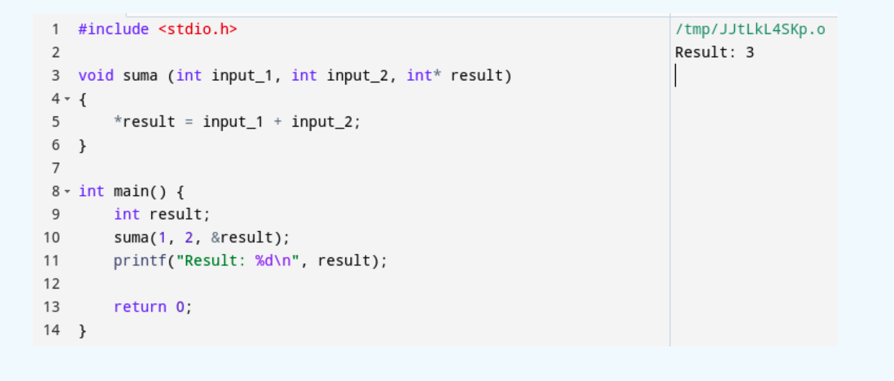

### F1: Demasiados Argumentos

- Lo mejor es que una función no reciba argumentos, seguido por uno, dos y tres argumentos. Se deben evitar las funciones con > 3 argumentos.
- Encapsular argumentos en una clase.

### F2: Argumentos de Salida

Los argumentos de salida son aquellos que se le pasan a una función para que ésta asigne su resultado final.
En ese argumento, en lugar de usar una variable de retorno, un return.

Este tipo de argumentos es muy utilizado en lenguajes como por ejemplo C.

Veamos un ejemplo.




En este código se declara una función suma que recibe dos enteros, los suma y el resultado lo introduce en la variable result, en lugar de utilizar un return.
En el main lo único que se hace es declarar un entero resultado y se llama a la función suma pasándole un 1, un 2 y esa variable result.

Para los que no conozcan C, con el ampersand se puede pasar una variable, una referencia de memoria a la variable, por lo que en la función en lugar de recibir una copia de la variable, se recibe la referencia de memoria a esta variable.

De esta forma se puede acceder y asignarle un resultado.
Este tipo de argumentos, como podéis ver, no son nada intuitivos y se deben evitar a toda costa.
Siempre debemos usar el retorno de las funciones.

### F3: Pasar Flags como argumentos

Un flag como argumento suele indicar que la función hace más de una cosa


Un boolean como argumento, suele indicar que la función hace más de una cosa.

Y como vimos en el tema de las funciones, ésta es una violación de un principio fundamental.
Cada función debe hacer únicamente una cosa, por lo que se recibe un bullían como argumento.
Lo más normal es que haga dos o más cosas.

```
private static final Double PREMIUM_DISCOUNT_FACTOR = 0.2;
private static final Double REGULAR_DISCOUNT_FACTOR = 0.1;

public Double calculateDiscount(Item item, boolean isPremium) ‹
    if(isPremium) {
        return item.getPrice() * PREMIUM_DISCOUNT_FACTOR;
    ｝
    return item.getPrice() * REGULAR_DISCOUNT_FACTOR;
}
```

Veamos un ejemplo muy típico aquí podemos ver una función calculá indi discount que recibe un ítem y demás un flag de si el usuario es premium o no y devuelve el descuento.

Si el usuario es premium, le aplicamos un descuento mayor y si no le aplicamos un descuento menor. Ya sólo con la presencia de este flag ya podemos ver que la función hace dos cosas.
En este caso estaría mucho mejor refactorizar esta función y dividirla en dos.
Una función que te calcule el descuento para un usuario premium y una función que te calcule el descuento para un usuario normal.

### F4: Funciones Muertas

Las funciones que no se llaman nunca se deben eliminar. Si la necesitamos en un futuro, la podremos encontrar en el software de control de versiones

Las funciones muertas son aquellas que no se llaman nunca, las que no necesitamos y se deben eliminar.
Tenemos que estar pendientes de si una función ya no la necesitamos más para eliminarla y que no moleste en nuestro código.

Si más tarde la necesitamos de nuevo, podemos ir al software de control de versiones a por ella.